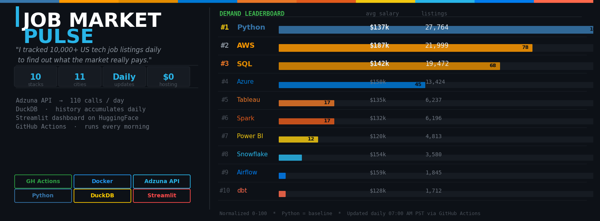
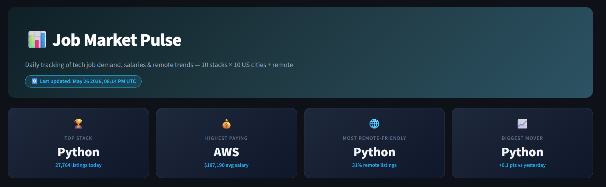
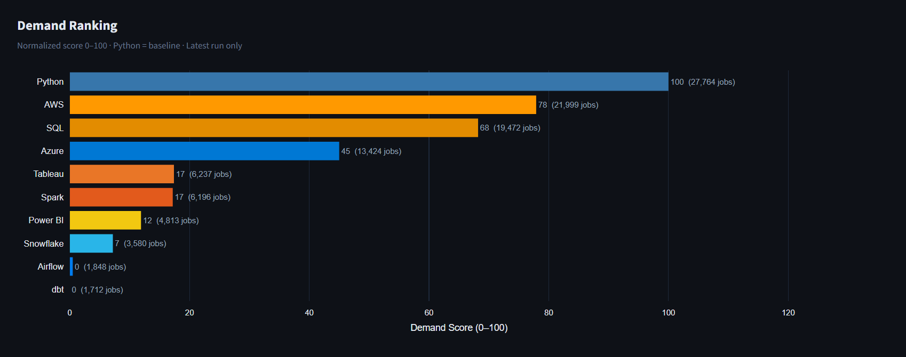
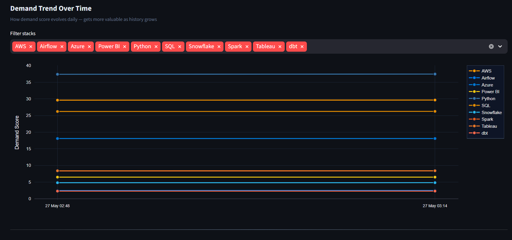
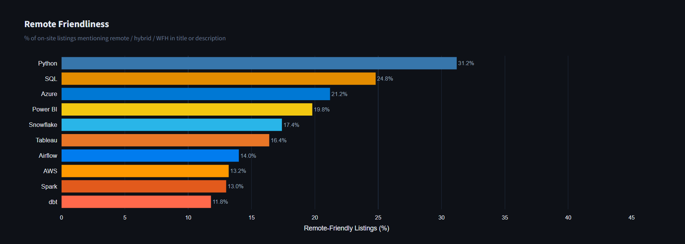
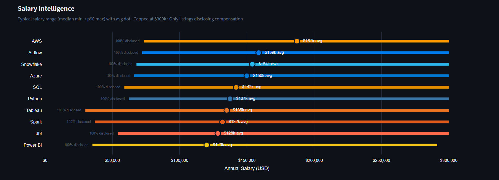
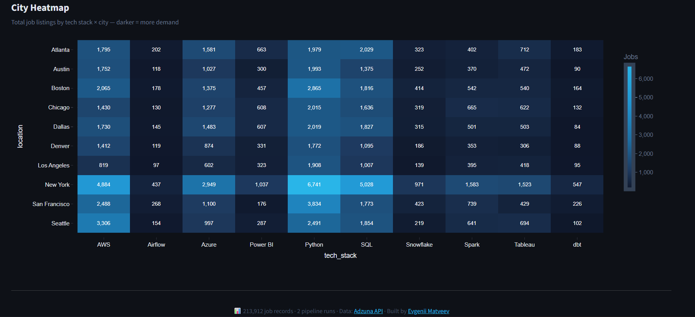

<p align="center">
  <a href="https://www.python.org/"></a>
  <a href="https://duckdb.org/"></a>
  <a href="https://streamlit.io/"></a>
  <a href="https://plotly.com/"></a>
  <a href=".github/workflows/pipeline.yml"></a>
  <a href="https://huggingface.co/spaces/evgeniimatveevusa/job-market-pulse"></a>
</p>

<!-- MARKET_PULSE:START -->

## 📰 Today's Market Report

> 🗓️ **May 26 2026** &nbsp;·&nbsp; Pipeline run **#2** &nbsp;·&nbsp; 220 total records

| 🏆 Top Stack | 💰 Highest Paying | 🌐 Most Remote-Friendly |
|---|---|---|
| **Python** — 27,764 listings | **AWS** — $187k avg | **Python** — 31% remote |

**Top 5 demand ranking (latest run):**

| Rank | Stack | Listings | Demand Score |
|------|-------|----------|--------------|
| 🥇 | **Python** | 27,764 | 37.5/100 |
| 🥈 | **AWS** | 21,999 | 29.7/100 |
| 🥉 | **SQL** | 19,472 | 26.3/100 |
| 4️⃣ | **Azure** | 13,424 | 18.1/100 |
| 5️⃣ | **Tableau** | 6,237 | 8.4/100 |

*Auto-updated daily by [GitHub Actions](.github/workflows/pipeline.yml) · Powered by [Adzuna API](https://www.adzuna.com/)*

<!-- MARKET_PULSE:END -->

---

Daily tracking of tech job demand, salaries & remote trends across **10 tech stacks × 10 US cities + remote** — from API ingestion to a live Streamlit dashboard. Refreshed automatically **once a day** via GitHub Actions. Zero manual steps after deploy.

> *"Built an end-to-end market intelligence pipeline: API → transform → DuckDB → visualize → automate. 10 stacks. 11 locations. $0 infrastructure cost."*

**[Live Demo → HuggingFace Spaces](https://huggingface.co/spaces/evgeniimatveevusa/job-market-pulse)**

---

## Dashboard

<details>
<summary>🏆 Hero & KPI Cards</summary>



</details>

<details>
<summary>📊 Demand Ranking</summary>



</details>

<details>
<summary>📈 Demand Trend Over Time</summary>



</details>

<details>
<summary>🌐 Remote Friendliness by Stack</summary>



</details>

<details>
<summary>💰 Salary Intelligence</summary>



</details>

<details>
<summary>🗺️ City Heatmap — Stack × City</summary>



</details>

---

## What it tracks

| Dimension | Detail |
|-----------|--------|
| **Tech stacks** | Python · SQL · Tableau · Power BI · dbt · Spark · Airflow · Snowflake · AWS · Azure |
| **Cities** | New York · LA · Chicago · SF · Seattle · Austin · Boston · Denver · Atlanta · Dallas + Remote |
| **Metrics** | Job count · Demand score · Salary avg/min/max · Remote % · Salary disclosure rate |
| **Cadence** | Daily at 7:00 AM PST via GitHub Actions |

---

## Architecture

```
Adzuna API  ──►  extract.py  ──►  transform.py  ──►  load.py
                                                        │
                                                   DuckDB file
                                                        │
                    ┌───────────────────────────────────┤
                    │                                   │
             HuggingFace Dataset                 GitHub Actions
             (persistent storage)                (daily cron)
                    │
             HuggingFace Space
             (Streamlit dashboard)
```

**Key design decision:** DuckDB file lives on a HuggingFace Dataset — downloaded before each run, updated after. Zero database hosting cost, full history preserved indefinitely.

---

## Demand Score formula

```
demand_score = (stack_count - min_count) / (max_count - min_count) × 100
```

Normalized per run so stacks are always comparable regardless of absolute count differences. Python = 100 baseline.

---

## Day 1 findings (May 26 2026)

| Rank | Stack | Jobs | Avg Salary | Remote % |
|------|-------|------|-----------|---------|
| #1 | Python | 27,764 | $137k | 31% |
| #2 | AWS | 21,999 | $187k | 13% |
| #3 | SQL | 19,472 | $142k | 25% |
| #4 | Azure | 13,424 | $150k | 21% |
| #10 | dbt | 1,712 | $128k | 12% |

*New York dominates every single stack. Python + SQL most remote-friendly. Airflow & dbt most niche.*

---

## Tech stack

`Python` · `DuckDB` · `Streamlit` · `Plotly` · `GitHub Actions` · `HuggingFace Spaces` · `Docker` · `Adzuna API`

---

*Data from [Adzuna](https://www.adzuna.com/) · Updated daily · Built by [Evgenii Matveev](https://github.com/evgeniimatveev)*
